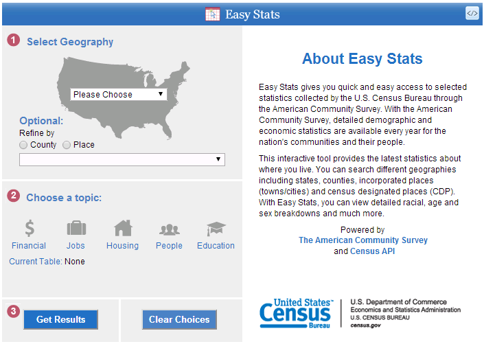

Census Data and Easy Stats
========================================================
author: Jim Curro and Alex Shum
date: April 2014

Easy Stats
========================================================
[easy stats](http://www.census.gov/easystats/)

Finding Variables
========================================================
[Variables](api.census.gov/data/2012/acs5/variables.json)
- Hard to find relevant information
- Inconsistent formatting (different capitalization)
- Search by keyword

Getting Data
========================================================
- Lookup table ID for relevant table
- Column names have redundant information
- Some information spread across tables
- Data not in tidy format
- String split to clean up data tables
- Used reshape2 to bring data into tidy format.

ggvis, animint, rCharts
========================================================
- These packages are not on CRAN...for a reason.
- animint doesn't work easily with shiny yet.
- Used rCharts and ggplot2

Shiny
========================================================
- Preview data with subsetting and filtering.
- Download data as CSV/TSV.
- Some graphical summaries as examples.

Future 
========================================================
- Better more interactive plots.
- Clean data in a more automated fashion.
- Expand on shiny

